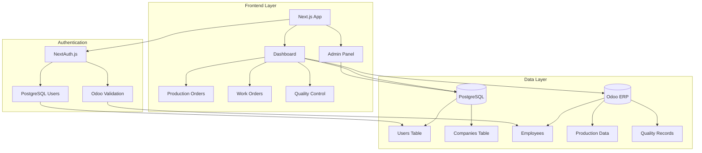
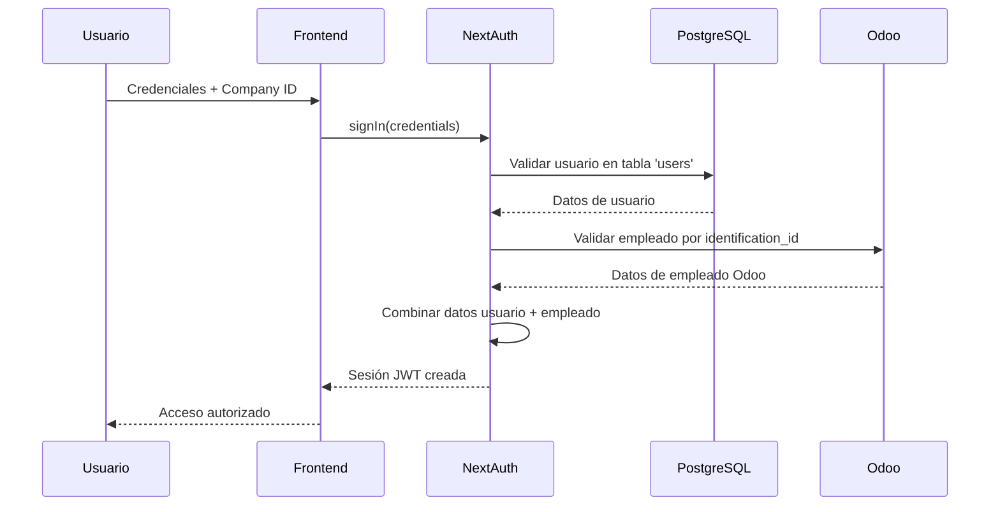
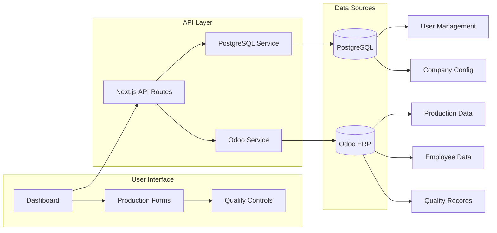

# Chronos Piso - Sistema de Gestión de Producción

Sistema de gestión para piso de producción industrial que integra órdenes de producción, órdenes de trabajo y controles de calidad con Odoo ERP.

## 📋 Descripción

Chronos Piso es una aplicación web moderna desarrollada en Next.js que facilita la gestión de procesos de producción industrial. El sistema permite a operarios, líderes y jefes de producción gestionar órdenes de trabajo, realizar controles de calidad y supervisar la producción en tiempo real.

### Características Principales

- **Gestión de Órdenes de Producción**: Creación y seguimiento de órdenes de producción
- **Órdenes de Trabajo**: Gestión completa del flujo de trabajo en el piso de producción
- **Control de Calidad**: Procesos de validación y control de calidad integrados
- **Integración con Odoo**: Sincronización bidireccional con sistemas ERP Odoo
- **Multi-empresa**: Soporte para múltiples empresas con configuraciones independientes
- **Roles y Permisos**: Sistema de autenticación basado en roles (Operario, Líder, Jefe)

## 🏗️ Arquitectura del Sistema

### Tecnologías Utilizadas

- **Frontend**: Next.js 14 (App Router), React 18, TypeScript
- **Autenticación**: NextAuth.js v4
- **Base de Datos**: PostgreSQL (Azure)
- **Integración ERP**: Odoo XML-RPC
- **Estilos**: Tailwind CSS
- **UI Components**: Headless UI, Heroicons, FontAwesome

### Estructura de Componentes

```
chronosps/
├── app/                    # Next.js App Router
│   ├── dashboard/         # Interface principal de producción
│   │   ├── production-orders/
│   │   ├── work-orders/
│   │   └── quality-control/
│   ├── admin/            # Panel administrativo interno
│   └── api/              # Endpoints de servidor
├── config/               # Configuración y constantes
├── types/                # Definiciones TypeScript
├── ui/                   # Componentes reutilizables
└── helper/               # Utilidades y helpers
```

## 🚀 Instalación y Configuración

### Prerequisitos

- Node.js 18+
- npm o yarn
- Acceso a base de datos PostgreSQL
- Instancia de Odoo configurada

### 1. Clonar el Repositorio

```bash
git clone [repository-url]
cd chronosps
```

### 2. Instalar Dependencias

```bash
npm install
```

### 3. Configurar Variables de Entorno

Crear archivo `.env` basado en `.env.template`:

```env
# NextAuth Configuration
NEXTAUTH_URL=http://localhost:3000/
NEXTAUTH_SECRET=your-secret-key

# PostgreSQL Database
CHRONOS_DB_USER=your-db-user
CHRONOS_DB_HOST=your-db-host
CHRONOS_DB_NAME=your-db-name
CHRONOS_DB_PASSWORD=your-db-password
CHRONOS_DB_PORT=5432

# Admin Credentials
CHRONOS_ADMIN_USER=admin@chronosps.com
CHRONOS_ADMIN_PASSWORD=secure-password
```

### 4. Configurar Base de Datos

Asegúrate de que las tablas `users` y `companies` estén creadas en PostgreSQL con la estructura requerida.

## 🏃‍♂️ Ejecutar la Aplicación

### Desarrollo

```bash
npm run dev
```

La aplicación estará disponible en [http://localhost:3000](http://localhost:3000)

### Usando Docker

```bash
docker-compose -f compose-local.yml up
```

### Producción

```bash
npm run build
npm run start
```

## 👥 Roles y Permisos

### Roles de Usuario

- **Operario**: Acceso a órdenes de producción y trabajo
- **Líder**: Acceso adicional a controles de calidad y planificación
- **Jefe**: Acceso completo a todas las funcionalidades
- **chronosAdmin**: Administrador interno del sistema

### Navegación por Rol

El sistema filtra automáticamente las opciones de navegación según el rol del usuario:

```typescript
// Configuración en config/nav-links.ts
{
  name: 'Órdenes de producción',
  role: ['Operario', 'Lider', 'Jefe']
}
```

## 🔐 Autenticación

### Flujo de Autenticación

1. **Credenciales**: Usuario ingresa código, contraseña y empresa
2. **Validación Local**: Verificación contra tabla `users` en PostgreSQL
3. **Validación Odoo**: Cross-reference con datos de empleado en Odoo
4. **Sesión**: Creación de sesión JWT con datos combinados

### Modos de Autenticación

- **Usuarios de Empresa**: Autenticación estándar para empleados
- **Administrador Chronos**: Acceso interno con credenciales de entorno

## 🔌 Integración con Odoo

### Servicios Disponibles

```typescript
// Obtener datos
getOdooData(model, filter, fields, limit, order, company_id, callback, userAdmin)

// Actualizar datos
setOdooData(model, ids, data, company_id, callback)

// Crear registros
createOdooData(model, data, company_id, callback, userAdmin)
```

### Configuración Multi-empresa

Cada empresa tiene su propia configuración de Odoo almacenada en la tabla `companies`:

- Domain, URL, Database
- Credenciales de conexión
- Configuración SSL

## 📊 Diagramas de Arquitectura

### 1. Arquitectura del Sistema



### 2. Flujo de Autenticación



### 3. Flujo de Datos



## 🧪 Testing y Calidad

### Comandos de Testing

```bash
npm run lint          # ESLint checks
npm run build         # Validar build de producción
```

### Estándares de Código

- TypeScript strict mode
- ESLint configuración Next.js
- Tailwind CSS para estilos
- Componentes reutilizables en `/ui`

## 📈 Monitoreo y Logging

- Logs de conexión a Odoo en consola
- Manejo de errores en operaciones de base de datos
- Validación de sesión en cada request

## 🚀 Despliegue

### Variables de Producción

Asegúrate de configurar todas las variables de entorno en tu plataforma de despliegue:

- Conexiones seguras a PostgreSQL
- URLs y secretos de NextAuth
- Credenciales de administrador

### Recomendaciones

- Usar HTTPS en producción
- Configurar SSL para conexiones de base de datos
- Implementar monitoreo de aplicación
- Backup regular de base de datos PostgreSQL

## 📚 Documentación Adicional

### Documentación del Proyecto
- [CLAUDE.md](./CLAUDE.md) - Guía para desarrollo con Claude Code
- [docs/ARCHITECTURE.md](./docs/ARCHITECTURE.md) - Arquitectura detallada del sistema
- [docs/API.md](./docs/API.md) - Documentación completa de APIs y endpoints
- [docs/DEPLOYMENT.md](./docs/DEPLOYMENT.md) - Guía completa de despliegue

### Documentación Externa
- [Next.js Documentation](https://nextjs.org/docs) - Framework documentation
- [NextAuth.js](https://next-auth.js.org/) - Authentication documentation
- [Odoo XML-RPC](https://www.odoo.com/documentation/16.0/developer/misc/api/odoo.html) - API integration
- [PostgreSQL Documentation](https://www.postgresql.org/docs/) - Database documentation

## 🤝 Contribución

1. Fork el proyecto
2. Crear rama de feature (`git checkout -b feature/AmazingFeature`)
3. Commit cambios (`git commit -m 'Add AmazingFeature'`)
4. Push a la rama (`git push origin feature/AmazingFeature`)
5. Abrir Pull Request

## 📝 Licencia

Este proyecto es propiedad de Chronos Piso.